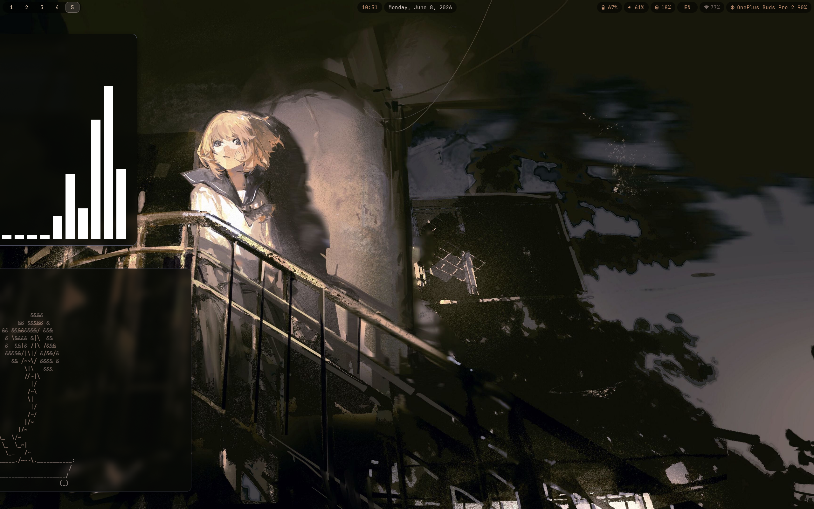
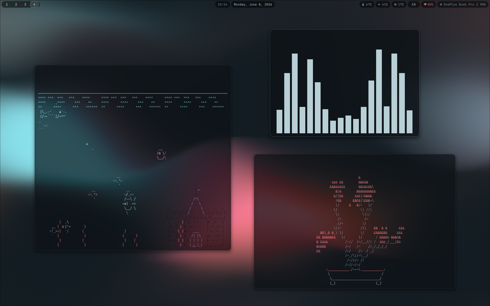
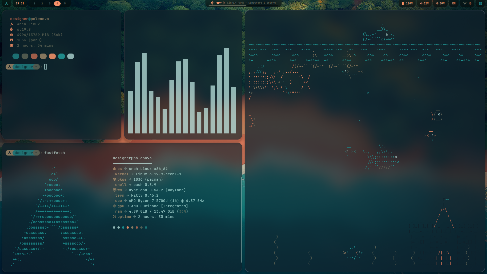
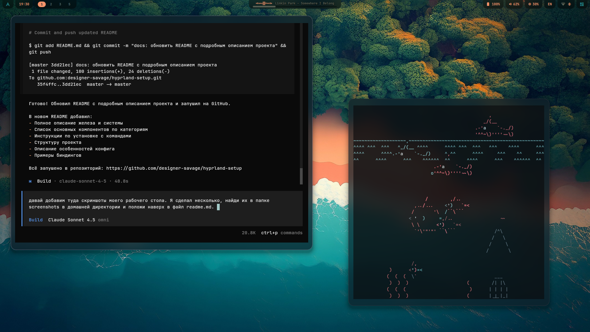
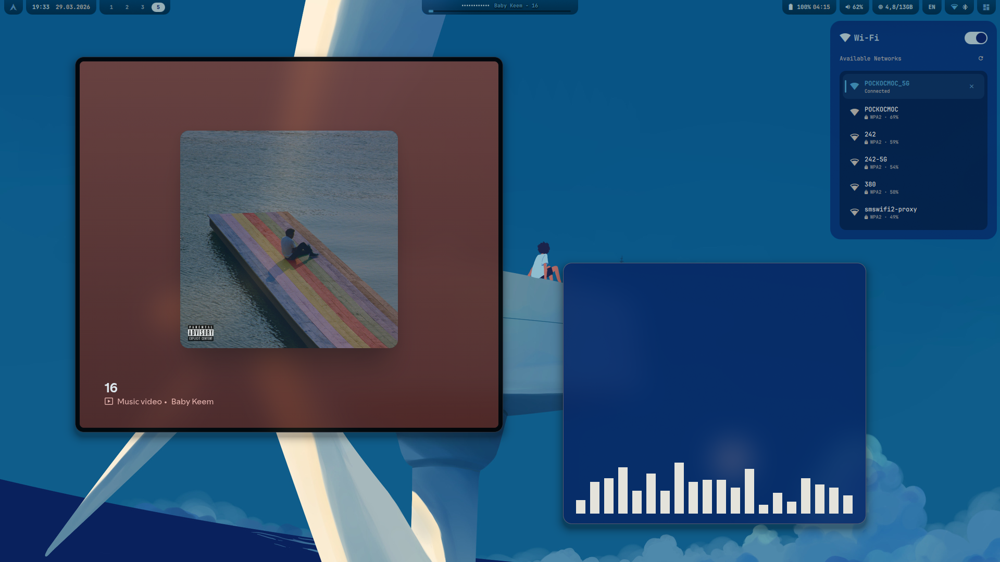

# My Dotfiles

Personal Arch Linux configuration with Hyprland and Quickshell. 🐧

## Screenshots







## Main Components

### Hyprland Ecosystem
- **hyprland** — tiling Wayland compositor 🖼️
- **hyprlock** — lock screen 🔒
- **hypridle** — idle management 😴
- **hyprpaper** — wallpaper manager 🖼️
- **hyprpicker** — color picker 🎨
- **hyprshot** — screenshot utility 📸

### UI & Bars
- **quickshell** — QML-based status bar (primary) 📊
- **waybar** — alternative bar (backup) 📊
- **swaync** — notification center 🔔
- **rofi/wofi** — application launchers 🚀

### Applications
- **kitty** — GPU-accelerated terminal 🐱
- **firefox** — web browser 🌐
- **dolphin/thunar** — file managers 📁
- **neovim/vim** — text editors ✏️
- **visual-studio-code** — IDE 💻
- **obs-studio** — screen recording 🎥
- **mpv/celluloid** — video player 🎬

### Utilities
- **paru/yay** — AUR helpers 📦
- **lazygit** — Git TUI 🔧
- **bottom/htop** — system monitoring 📊
- **fastfetch** — system information 💻
- **eza** — modern ls replacement 📄
- **brightnessctl** — brightness control ☀️
- **blueman** — Bluetooth manager 📶

## Project Structure

```
.
├── .config/
│   ├── hypr/           # Modular Hyprland configs
│   ├── quickshell/     # QML status bar config
│   ├── kitty/          # Terminal config
│   └── waybar/         # Alternative bar
├── install.sh          # Config installation script
├── packages.txt        # List of installed packages
└── README.md
```

## Installation

### 1. Clone the repository

```bash
git clone https://github.com/designer-savage/my-dotfiles.git
cd my-dotfiles
```

### 2. Install packages

Install all packages from `packages.txt`:

```bash
yay -S --needed $(cat packages.txt | awk '{print $1}')
```

Or selectively install only the components you need.

### 3. Install configs

The script will create symlinks to configs (existing ones will be backed up):

```bash
chmod +x install.sh
./install.sh
```

### 4. Restart Hyprland

After installation, restart Hyprland or re-login.

## Features

- Modular Hyprland config structure (split into separate files) 🧩
- Quickshell with QML for flexible status bar customization 🎨
- Configured power management (TLP, cpupower) 🔋
- Pipewire for audio 🔊
- NetworkManager + iwd for networking 🌐
- Automatic backups when installing configs 💾

## Key Bindings

Main keybindings are configured in `.config/hypr/binds.conf`. Examples:

- `Super + Q` — close window ❌
- `Super + Return` — open terminal 🖥️
- `Super + D` — application launcher 🚀
- `Super + F` — fullscreen 🔍
- `Super + [1-9]` — switch workspaces 🔄

See the config for the full list.
