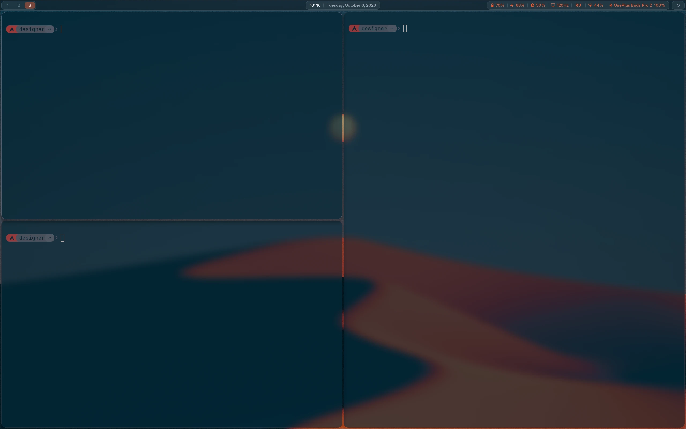
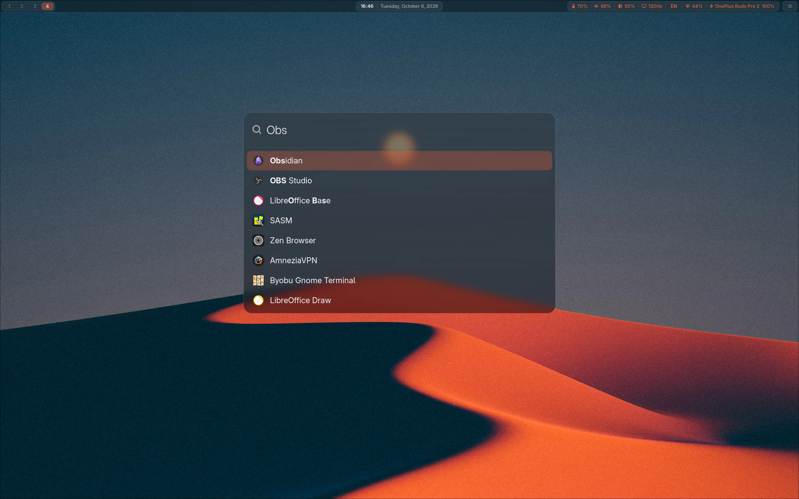
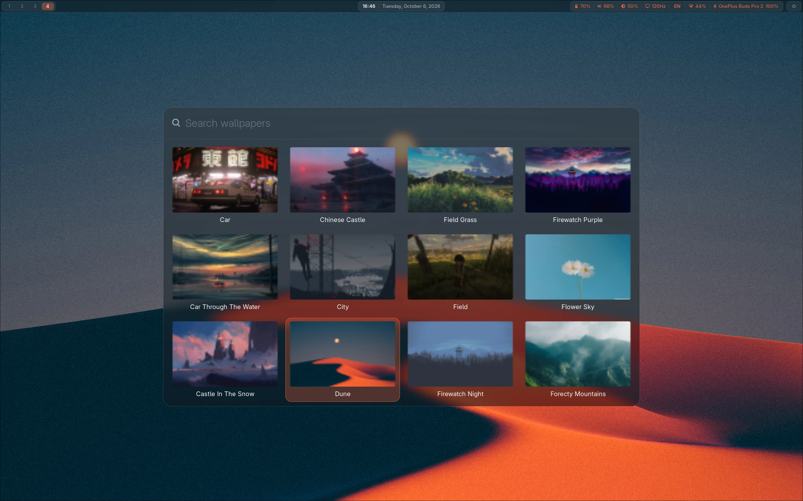
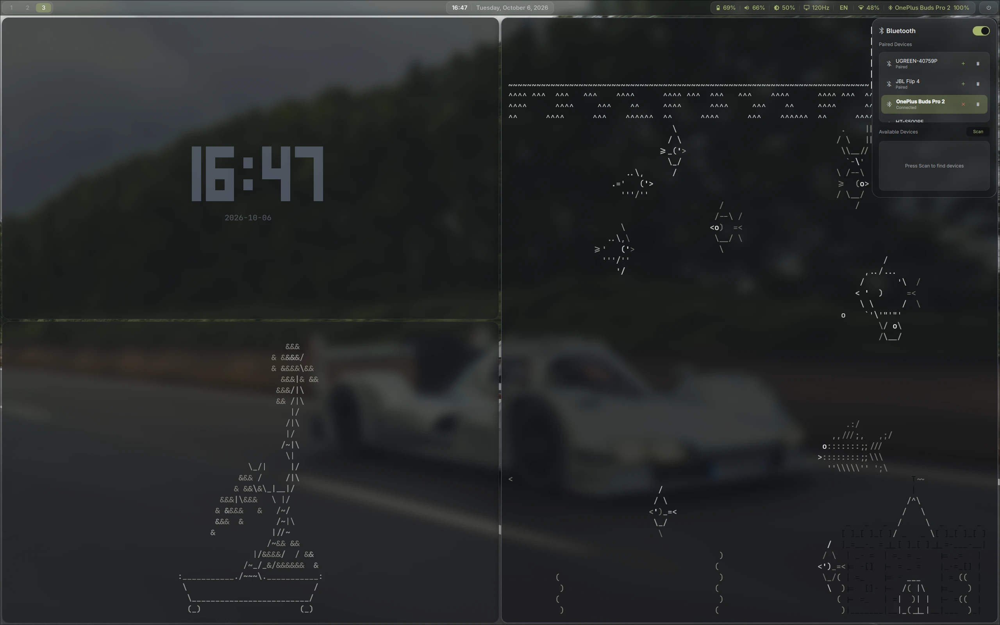

# my-dotfiles

Arch Linux desktop built on Hyprland, with one visual language across every surface:
translucent "glass" panels blurred by the compositor, and a single accent colour taken
from the current wallpaper.

The bar, the launcher, the notification centre, the Wi-Fi/Bluetooth/power panels and
the lock screen all read the same generated design tokens, so changing the wallpaper
re-themes the whole desktop at once.

## Screenshots






## Components

| Role | Tool | Config |
|---|---|---|
| Compositor | Hyprland 0.56+ (Lua config) | `.config/hypr/` |
| Lock / idle | hyprlock, hypridle | `.config/hypr/hyprlock.conf`, `hypridle.conf` |
| Bar | Waybar | `.config/waybar/` |
| Launcher and menus | rofi | `.config/rofi/` |
| Wi-Fi, Bluetooth, power panels | Quickshell | `.config/quickshell/` |
| Notifications | swaync | `.config/swaync/` |
| Wallpaper | awww | `.local/bin/wallpaper-apply.sh` |
| Colour scheme | pywal + `gen-glass-theme.py` | `.config/wal/templates/`, `.local/bin/` |
| Touchpad gestures | libinput-gestures | `.config/libinput-gestures.conf` |
| Terminal | kitty | `.config/kitty/` |
| Shell | fish, starship, fastfetch | `.config/fish/`, `.config/starship.toml`, `.config/fastfetch/` |

## Repository layout

```
.
├── .config/
│   ├── hypr/            Hyprland modules, hyprlock, hypridle
│   ├── waybar/          bar layout, style, custom module scripts
│   ├── rofi/            Spotlight-style launcher, wallpaper grid, compact menu
│   ├── quickshell/      QML panels for Wi-Fi, Bluetooth and power
│   ├── swaync/          notification centre layout and style
│   ├── wal/templates/   pywal templates for Hyprland, GTK and rofi
│   ├── scripts/         screenshots, night light, caffeine, battery, dictionary
│   ├── kitty/  fish/  fastfetch/
│   ├── starship.toml
│   └── libinput-gestures.conf
├── .local/
│   └── bin/             wallpaper pipeline, theme generator, refresh-rate toggle
├── screenshots/
├── install.sh
└── packages.txt
```

## Installation

The configs target Arch Linux. Hyprland must be **0.56 or newer**: the config is
written in Lua and older releases only read `hyprland.conf`.

```bash
git clone https://github.com/designer-savage/my-dotfiles.git
cd my-dotfiles
grep -v '^#' packages.txt | paru -S --needed -
./install.sh
```

`install.sh` symlinks everything into `~/.config` and `~/.local/bin`. Anything already in place is moved aside with a
`.backup.<timestamp>` suffix, nothing is deleted.

After that:

1. Put a few images into `~/wallpapers`.
2. Add yourself to the `input` group and enable the gesture daemon:
   `sudo gpasswd -a $USER input`, then `systemctl --user enable --now libinput-gestures`.
3. Log into Hyprland and pick a wallpaper with `Super+W`. Until the first wallpaper
   is applied the generated colour files do not exist yet, so the bar and the
   launcher start unstyled.
4. Optionally put a square avatar at `~/.face` for the lock screen.

The lock screen clock uses `OPPO Big Clock Wide`, a proprietary ColorOS font that is
not redistributed here. Without it hyprlock falls back to the default font; change
`font_family` on the clock label in `hypr/hyprlock.conf` to whatever you prefer.

### Adapting it to another machine

A few values are specific to the laptop this was built on:

- **Monitor:** `hypr/monitor.lua` sets `eDP-1` to 2560x1600 at 120 Hz.
  `hypr-monitor-hz.sh` assumes the same output.
- **Keyboard device:** layout switching calls
  `hyprctl switchxkblayout at-translated-set-2-keyboard`. Find yours with
  `hyprctl devices` and replace it in `hypr/binds.lua` and `waybar/config.jsonc`.
- **Applications:** `Super+B` and `Super+G` launch Chrome and Claude Desktop.

## How theming works

Applying a wallpaper (`Super+W`, `Super+Shift+W`, or `wallpaper-apply.sh <image>`) runs
one pipeline:

1. `awww` crossfades to the new image.
2. `wal` regenerates the palette in `~/.cache/wal/` and renders the templates.
3. `wal-postprocess.sh` runs `gen-glass-theme.py`, reloads swaync's CSS and Waybar,
   and copies the GTK colours.
4. `gen-glass-theme.py` writes the shared design tokens:
   `rofi/glass.rasi`, `waybar/glass.css`, `swaync/glass.css`,
   `~/.cache/wal/glass.json` (Quickshell) and `~/.cache/wal/glass-hyprlock.conf`.

The accent is sampled from the **image**, not from pywal's palette. Each quantised
colour is scored by area, chroma and a lightness weight that rules out near-black
and near-white, so the accent is a colour you can actually see in the picture
rather than a saturated shade from a dark corner of the sky. Hue is never changed;
saturation and lightness are only nudged as far as needed to stay legible on glass.

The panels themselves stay neutral. rofi, Waybar and swaync only paint a translucent
fill; the blur comes from Hyprland layer rules in `hypr/layerrules.lua`.
`ignore_alpha` on those rules keeps the rounded corners from being blurred into a
rectangle.

## Hyprland notes

The config is split into modules that `hyprland.lua` loads with `require()`:
`monitor`, `autostart`, `decoration`, `animations`, `input`, `binds`, `windowrules`,
`layerrules` and `bar`.

- **IPC syntax.** With a Lua config, the legacy forms such as
  `hyprctl dispatch workspace 2` or `hyprctl keyword …` are rejected. Use
  `hyprctl dispatch 'hl.dsp.focus({ workspace = 2 })'` and `hyprctl eval '…'`.
- **Workspace buttons.** Waybar's native `hyprland/workspaces` module still
  dispatches the old way, so clicks do nothing
  ([Waybar #5008](https://github.com/Alexays/Waybar/issues/5008)). The bar uses
  `custom/ws1`–`ws10` backed by `waybar/scripts/ws.sh` instead, and `hypr/bar.lua`
  signals Waybar on workspace events. Empty workspaces are hidden.
- **Refresh rate.** 120 Hz is the baseline on battery and on AC alike. `Super+H`
  drops to 60 Hz and back; the choice survives `hyprctl reload`.
- **Touchpad scrolling.** Toolkits interpret the compositor's scroll delta
  differently (Chromium and GTK amplify it about 12x, Gecko 4x, Qt and kitty use it
  as raw pixels). Per-class rules in `hypr/windowrules.lua` scale them so every app
  scrolls the same distance per finger movement.
- **Workspace swipes.** Three-finger swipes are handled by libinput-gestures, one
  fixed step per completed swipe, not by Hyprland's interactive gesture.
- **Idle.** Dim after 5 minutes, screen off after 10, lock after 29.
  `Super+I` (or the cup icon in the bar) suspends all of it.

## Key bindings

`Super` is the Windows key. The full list is in `.config/hypr/binds.lua`.

**Applications**

| Keys | Action |
|---|---|
| `Super+Return` | Terminal |
| `Super+Shift+Return` | Floating terminal |
| `Super+R` | Launcher |
| `Super+E` | File manager |
| `Super+B` | Browser |
| `Super+L` | Lock screen |
| `Menu` | Look up the selected word in a dictionary |

**Windows**

| Keys | Action |
|---|---|
| `Super+Q` | Close window |
| `Super+F` | Fullscreen |
| `Super+C` | Toggle floating |
| `Super+Shift+C` | Pin a window on every workspace, picture-in-picture style |
| `Super+P` / `Super+J` | Pseudo-tile / toggle split |
| `Super+Arrows` | Move focus |
| `Super+Shift+Arrows` | Move window |
| `Super+Ctrl+Arrows` | Resize window |
| `Super+Tab` | Cycle windows |
| `Super+drag` / `Alt+drag` | Move / resize with the mouse |

**Workspaces**

| Keys | Action |
|---|---|
| `Super+1`…`Super+0` | Switch to workspace 1–10 |
| `Super+Shift+1`…`0` | Move window to workspace 1–10 |
| `Super+S` / `Super+Shift+S` | Toggle / send to the scratch workspace |
| `Super+Scroll` | Next / previous workspace |
| Three-finger swipe | Next / previous workspace |

**System**

| Keys | Action |
|---|---|
| `Super+W` | Wallpaper picker |
| `Super+Shift+W` | Random wallpaper |
| `Super+N` | Night light |
| `Super+I` | Keep the screen awake |
| `Super+H` | Toggle 120 / 60 Hz |
| `Super+Space` | Switch keyboard layout |
| `Super+Shift+N` | Clear notifications |
| `Print` / `Shift+Print` | Screenshot of an area / the whole screen |
| `Super+Shift+R` | Stop gpu-screen-recorder |
